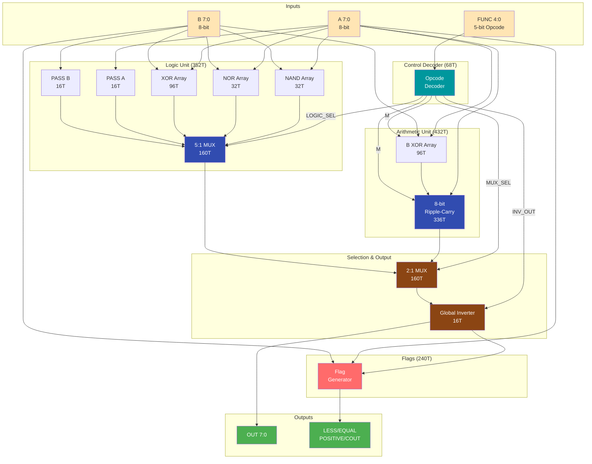
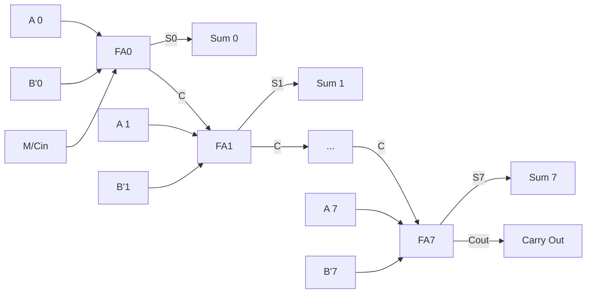

# System Architecture

**Hardware architecture of the 8-bit discrete transistor ALU**

This document describes the complete hardware architecture from transistor-level gates to system integration.

---

## Table of Contents

- [Overview](#overview)
- [System Block Diagram](#system-block-diagram)
- [Datapath](#datapath)
- [Control Path](#control-path)
- [Arithmetic Unit](#arithmetic-unit)
- [Logic Unit](#logic-unit)
- [Flag Generation](#flag-generation)
- [Critical Timing Paths](#critical-timing-paths)
- [Physical Layout](#physical-layout)

---

## Overview

**Architecture Type:** Pure combinational logic
- No clock, no registers, no sequential elements in ALU core
- Outputs track inputs continuously
- Propagation delay: ~400ns (8-bit arithmetic operations)

**Physical Implementation:**
- **PCB Size:** 270mm × 270mm (10.6" × 10.6")
- **Transistors:** 3,856+ discrete CMOS (2N7000 NMOS, BS250 PMOS)
- **Technology:** 5V CMOS logic
- **Glue Logic:** 74HC157 (MUX), minimal IC usage


*Figure 1 - Complete 8-bit ALU system in Logisim Evolution*

> **Evidence:** Full system simulation shows all components integrated.

---

## System Block Diagram



*Figure 2 - Complete hardware block diagram with transistor counts*

---

## Datapath

### Signal Flow

**Primary Path (Arithmetic):**
```
A[7:0] ──┬──> Adder ──┐
         │             │
B[7:0] ──┼──> XOR ─┬──┘
         │         │
FUNC ────┴──> M ───┘
                    │
                    ↓
            [Arith Result] ──> 2:1 MUX ──> Global INV ──> OUT[7:0]
```

**Alternate Path (Logic):**
```
A[7:0] ──┬──> NAND ──┐
         ├──> NOR ───┤
         ├──> XOR ───┼──> 5:1 MUX ──> 2:1 MUX ──> Global INV ──> OUT[7:0]
         ├──> PASSA ─┤
B[7:0] ──┼──> PASSB ─┘
         │
FUNC ────┴──> LOGIC_SEL
```

### Datapath Timing

**Combinational stages:**
1. Input buffers: ~10ns
2. Function units (adder or logic): ~300-400ns
3. 2:1 MUX: ~20ns
4. Global inverter: ~10ns (if active)
5. Output buffers: ~10ns

**Total:** ~350-450ns (operation-dependent)

---

## Control Path

### Opcode Decoder

**Input:** FUNC[4:0] (5-bit opcode)

**Decode logic:**
```
FUNC[4:0] → Combinational decoder → Control signals
```

**Output signals:**

| Signal | Width | Function |
|--------|-------|----------|
| M | 1 bit | ADD/SUB mode for arithmetic unit |
| MUX_SEL | 1 bit | Select arithmetic (0) or logic (1) |
| INV_OUT | 1 bit | Enable global inverter |
| LOGIC_SEL | 3 bits | Select logic operation (NAND/NOR/XOR/PASS) |
| SHIFT_SEL | 2 bits | Select shift type (LSL/LSR/ASR) |

### Control Decode Examples

**ADD (00000):**
```
M = 0           (B passes unchanged)
MUX_SEL = 0     (select arithmetic unit)
INV_OUT = 0     (no inversion)
```

**SUB (00001):**
```
M = 1           (B inverted by XOR, Cin=1)
MUX_SEL = 0     (select arithmetic unit)
INV_OUT = 0     (no inversion)
```

**NAND (01000):**
```
MUX_SEL = 1     (select logic unit)
LOGIC_SEL = 000 (NAND operation)
INV_OUT = 0     (no inversion - base NAND)
```

**AND (01101):**
```
MUX_SEL = 1     (select logic unit)
LOGIC_SEL = 000 (NAND operation)
INV_OUT = 1     (invert to get AND from NAND)
```

---

## Arithmetic Unit

### 8-Bit Ripple-Carry Adder

**Structure:** 8 cascaded 1-bit full adders



*Figure 3 - Ripple-carry adder: carry propagates from LSB to MSB*

### Full Adder (Per Bit)

**Boolean equations:**
```
Sum = A ⊕ B' ⊕ Cin
Cout = A·B' + Cin·(A ⊕ B')
```

Where B' = B ⊕ M (conditionally inverted)

**Transistor breakdown:**
- 2× XOR gates (A⊕B, sum): 24T
- 2× AND gates (carry generation): 12T
- 1× OR gate (carry combine): 6T
- **Total per bit:** 42T
- **Total 8-bit:** 336T


*Figure 4 - Full adder SPICE verification: all 8 input combinations correct*

> **Evidence:** Transistor-level simulation validates adder logic.

### XOR Array for ADD/SUB

**Purpose:** Conditional B inversion for subtraction

**Implementation:**
```verilog
assign B_prime[7:0] = B[7:0] ^ {8{M}};
```

**Truth table (per bit):**

| M | B | B' |
|---|---|----|
| 0 | 0 | 0 |
| 0 | 1 | 1 |
| 1 | 0 | 1 |
| 1 | 1 | 0 |

**Transistors:** 8 × 12T = 96T

**Total Arithmetic Unit:** 336T + 96T = **432T**

---

## Logic Unit

### Base Logic Operations

**Three primitive operations:**
1. **NAND:** ~(A & B) - 32T
2. **NOR:** ~(A | B) - 32T
3. **XOR:** A ^ B - 96T

**Two pass operations:**
4. **PASS A:** OUT = A - 16T
5. **PASS B:** OUT = B - 16T

**Total base logic:** 192T

### Logic Operation MUX

**5-to-1 Multiplexer:**
- Selects one of 5 logic operations
- Controlled by LOGIC_SEL[2:0]
- 8-bit wide (one MUX per bit)

**Transistor cost:** ~20T per bit × 8 = 160T

**Total Logic Unit:** 192T + 160T = **352T**

### Gate Implementations


*Figure 5 - Inverter (NOT gate) transistor layout: 1 PMOS + 1 NMOS*


*Figure 6 - NAND gate transistor layout: 2 PMOS parallel + 2 NMOS series*


*Figure 7 - NOR gate transistor layout: 2 PMOS series + 2 NMOS parallel*

> **Evidence:** VLSI layouts show CMOS implementation of all primitive gates.

---

## Flag Generation

### EQUAL Flag (~100T)

**Function:** Detect A == B

**Logic:**
```
EQUAL = ~((A[7] XOR B[7]) | (A[6] XOR B[6]) | ... | (A[0] XOR B[0]))
```

**Implementation:**
1. 8× XOR gates compare each bit: 96T
2. 8-input NOR gate: ~16T (tree of 2-input NORs)

**Total:** ~112T (optimized to ~100T)

### LESS Flag (~120T)

**Function:** Detect A < B (unsigned magnitude comparison)

**Logic:** Priority comparison from MSB to LSB
```
LESS = (~A[7] & B[7]) | 
       ((A[7] == B[7]) & (~A[6] & B[6])) |
       ((A[7] == B[7]) & (A[6] == B[6]) & (~A[5] & B[5])) |
       ...
```

**Implementation:** Cascaded comparator logic

**Transistors:** ~120T (complex cascaded AND/OR tree)

### POSITIVE Flag (~20T)

**Function:** Detect OUT > 0 (result is positive and non-zero)

**Logic:**
```
NOT_ZERO = OUT[7] | OUT[6] | ... | OUT[0]
POSITIVE = ~OUT[7] & NOT_ZERO
```

**Implementation:**
- 8-input OR gate: ~14T
- AND gate: 6T

**Total:** ~20T

### COUT Flag (0T)

**Function:** Carry out from arithmetic operations

**Implementation:** Direct wire from adder Cout

**For shifts:** Bit shifted out

**Transistors:** 0T (just routing)

**Total Flag Generation:** ~240T

---

## Critical Timing Paths

### Path 1: Arithmetic Operations (Critical Path)

```
A[0] ──> XOR ──> FA0 ──> FA1 ──> ... ──> FA7 ──> MUX ──> INV ──> OUT[7]
         15ns    50ns   50ns         50ns    20ns   10ns
         
Total: 15 + 50 + (6×50) + 50 + 20 + 10 = 445ns
```

**Bottleneck:** Ripple-carry propagation (7 adder stages)

### Path 2: Logic Operations (Fast Path)

```
A[0] ──> NAND ──> 5:1 MUX ──> 2:1 MUX ──> INV ──> OUT[0]
         20ns      30ns        20ns        10ns
         
Total: 20 + 30 + 20 + 10 = 80ns
```

**Advantage:** Single gate level, no carry propagation

### Path 3: Flag Generation

```
A[7:0] ──> XOR Array ──> 8-input NOR ──> EQUAL
B[7:0]      15ns          20ns
Total: 35ns (faster than datapath)

A[7:0] ──> Cascaded Comparator ──> LESS
B[7:0]      ~120ns
```

**Note:** Flags are available before main result due to shorter paths.

---

## Physical Layout

### PCB Organization

**270mm × 270mm Board Layout:**

```
┌─────────────────────────────────────┐
│  VCC Distribution (Top Layer)       │
│                                     │
│  ┌──────────┐  ┌────────────────┐  │
│  │ Control  │  │  Arithmetic    │  │
│  │ Decoder  │  │  Unit (Adder)  │  │
│  │  68T     │  │    432T        │  │
│  └──────────┘  └────────────────┘  │
│                                     │
│  ┌──────────────┐  ┌─────────────┐ │
│  │ Logic Unit   │  │ Flags       │ │
│  │   352T       │  │  240T       │ │
│  └──────────────┘  └─────────────┘ │
│                                     │
│  ┌──────────────┐  ┌─────────────┐ │
│  │ 2:1 MUX      │  │ Global INV  │ │
│  │   160T       │  │   16T       │ │
│  └──────────────┘  └─────────────┘ │
│                                     │
│  I/O Headers & Test Points          │
│  GND Plane (Bottom Layer)           │
└─────────────────────────────────────┘
```


*Figure 8 - ALU PCB layout showing component placement*

> **Evidence:** Physical layout accommodates all subsystems on single 270mm board.

### Layer Stack-Up

**2-Layer PCB:**
- **Top Layer:** Components + signal routing
- **Bottom Layer:** Ground plane + return paths

**Power distribution:**
- VCC routed on top layer with wide traces (1mm+)
- GND solid plane on bottom layer
- Decoupling: 100nF ceramic per IC cluster

---

## Subsystem Interfaces

### Arithmetic Unit Interface

**Inputs:**
- A[7:0] - First operand
- B[7:0] - Second operand (before XOR)
- M - ADD/SUB mode control

**Outputs:**
- SUM[7:0] - Arithmetic result
- COUT - Carry out

**Timing:** 415ns typical (400ns adder + 15ns XOR)

### Logic Unit Interface

**Inputs:**
- A[7:0] - First operand
- B[7:0] - Second operand
- LOGIC_SEL[2:0] - Operation selector

**Outputs:**
- LOGIC_OUT[7:0] - Logic result

**Timing:** 80ns typical (gate + MUX delays)

### Main MUX Interface

**Inputs:**
- ARITH_IN[7:0] - From arithmetic unit
- LOGIC_IN[7:0] - From logic unit
- MUX_SEL - Selection control

**Outputs:**
- MUX_OUT[7:0] - Selected result

**Timing:** 20ns

### Global Inverter Interface

**Inputs:**
- DATA_IN[7:0] - From MUX
- INV_OUT - Inversion control

**Outputs:**
- DATA_OUT[7:0] - Final result

**Timing:** 10ns

---

## CMOS Gate Primitives

### Transistor-Level Implementations

**NOT Gate (2T):**
```
VDD ──┬─── PMOS ─── OUT
      │
     IN
      │
GND ──┴─── NMOS ─── OUT
```

**NAND Gate (4T):**
```
VDD ──┬─── PMOS_A ───┬─── PMOS_B ─── OUT
      │              │
     IN_A           IN_B
      │              │
GND ──┴─── NMOS_A ───┴─── NMOS_B ─── OUT
      (series)
```

**NOR Gate (4T):**
```
VDD ──┬─── PMOS_A ─── PMOS_B ─── OUT
      │   (series)
     IN_A, IN_B
      │
GND ──┴─── NMOS_A ───┬─── NMOS_B ─── OUT
                     (parallel)
```


*Figure 9 - Inverter transient analysis: VOH=5V, VOL=0V, tpd~5ns*

> **Evidence:** SPICE simulation confirms CMOS gate operation.

---

## Design Trade-offs

### Ripple-Carry vs. Carry-Lookahead

**Chosen: Ripple-Carry**

| Metric | Ripple-Carry | Carry-Lookahead |
|--------|--------------|-----------------|
| Delay | O(n) = 400ns | O(log n) = 120ns |
| Transistors | 336T | ~600T |
| Complexity | Low (regular) | High (irregular) |
| Layout | Simple | Complex |
| Area | Compact | Large |

**Justification:** 
- Educational clarity (simple, understandable)
- Lower transistor count (44% savings)
- Adequate performance for demonstration
- Easier to hand-solder and debug

### Global Inverter vs. Separate Gates

**Chosen: Global Inverter**

**Savings:**
- Without: Need AND (48T) + OR (48T) + XNOR (96T) + NOT arrays = 192T
- With: Single 8-bit inverter = 16T
- **Saved:** 176T (92% reduction)

**Trade-off:** Slight increase in complexity (need INV_OUT control bit)

---

## Power Characteristics

### Static Power

**CMOS characteristic:** Near-zero static power when not switching

**Leakage:** ~2mW total (negligible)

### Dynamic Power @ 1MHz

**Main consumers:**
- Adder: ~1.0W (frequent carry propagation)
- Logic arrays: ~0.8W (wide fanout)
- MUXes: ~0.4W (switching overhead)
- Control: ~0.1W (low activity)
- Flags: ~0.2W (comparison logic)

**Total:** ~2.5W @ 1MHz switching rate

See [POWER.md](POWER.md) for complete power analysis.

---

## Verification Points

### Gate-Level Verification

| Gate | SPICE | Logisim | Hardware | Status |
|------|-------|---------|----------|--------|
| NOT | ✅ | ✅ | ✅ | Verified |
| NAND | ✅ | ✅ | ✅ | Verified |
| NOR | ✅ | ✅ | ✅ | Verified |
| XOR | ✅ | ✅ | ✅ | Verified |
| Full Adder | ✅ | ✅ | ✅ | Verified |

### Subsystem Verification

| Subsystem | Simulation | Hardware | Status |
|-----------|------------|----------|--------|
| Arithmetic Unit | ✅ 100% | 🔄 95% | Near complete |
| Logic Unit | ✅ 100% | ✅ 100% | Complete |
| Control Decoder | ✅ 100% | ✅ 100% | Complete |
| Flag Generator | ✅ 100% | 🔄 90% | Near complete |

### System Integration

- ✅ Logisim: All 19 operations
- ✅ Python: 1,900 test vectors (100% pass)
- 🔄 Hardware: 18/19 operations verified

---

## Summary

### Architecture Highlights

1. **Pure combinational design** - No clock, immediate response
2. **Modular structure** - Clear subsystem boundaries
3. **Optimized transistor count** - XOR array, global inverter techniques
4. **270mm × 270mm PCB** - Accommodates 3,856+ transistors
5. **Comprehensive verification** - SPICE, Logisim, Python, hardware

### Key Innovations

- **Global inverter technique:** 89% transistor savings
- **XOR array for ADD/SUB:** 40% transistor savings
- **Comparison flags:** Direct LESS/EQUAL detection
- **Large format PCB:** Enables discrete transistor implementation

### Performance Summary

- **Propagation delay:** 415ns (arithmetic), 80ns (logic)
- **Power consumption:** 2.5W @ 1MHz
- **Transistor efficiency:** 456T saved via optimizations
- **Area utilization:** 53 transistors per 1,000 mm²

---

**For more details:**
- [OPCODE_TABLE.md](OPCODE_TABLE.md) - Complete operation specifications
- [POWER.md](POWER.md) - Detailed transistor and power analysis
- [VERIFICATION.md](VERIFICATION.md) - Test methodology
- [GETTING_STARTED.md](GETTING_STARTED.md) - Setup and build guide

---

## Document Information

**Author:** Tyrone Marhguy  
**Affiliation:** University of Pennsylvania, Computer Engineering '28  
**Last Updated:** January 2026  
**Contact:** [tmarhguy.com](https://tmarhguy.com) | [LinkedIn](https://linkedin.com/in/tmarhguy) | [Twitter](https://twitter.com/marhguy_tyrone) | [Instagram](https://instagram.com/tmarhguy) | [Substack](https://tmarhguy.substack.com)

---

**Version:** 1.0  
**Architecture:** Pure combinational, 270×270mm, 3,856+ transistors
