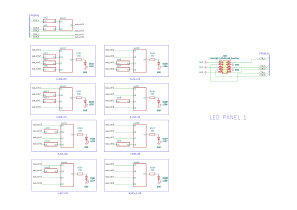
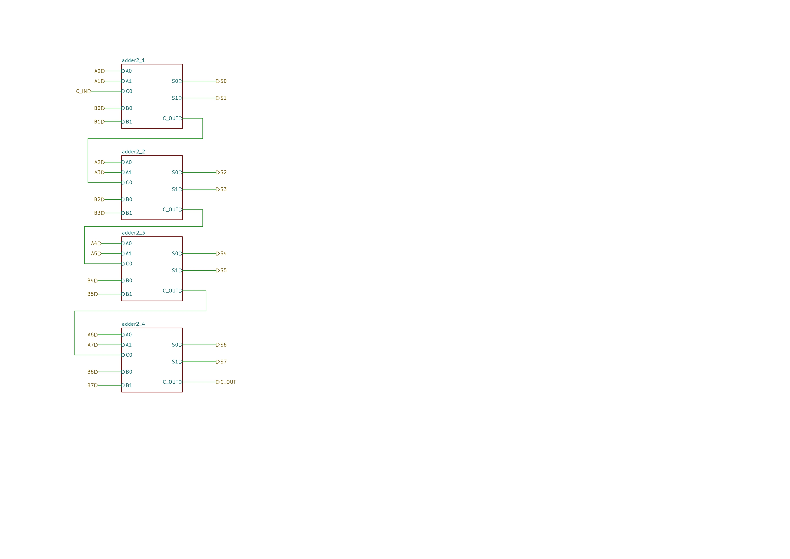
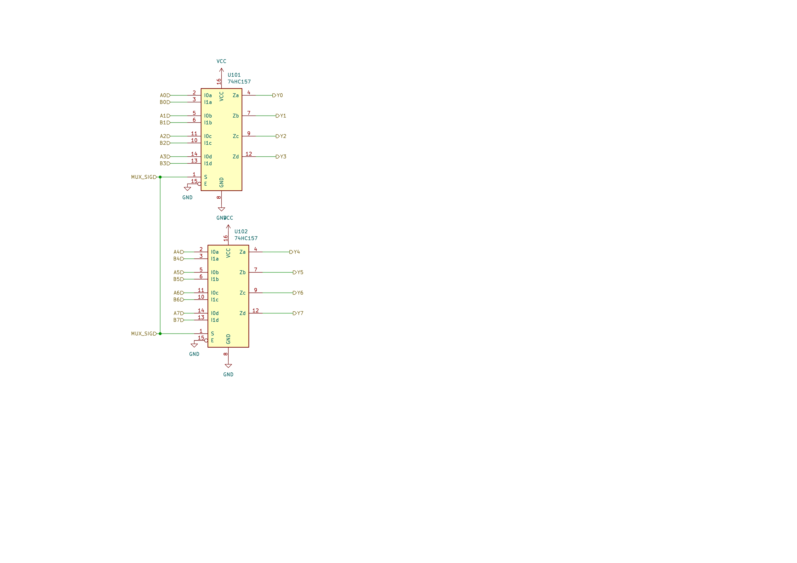
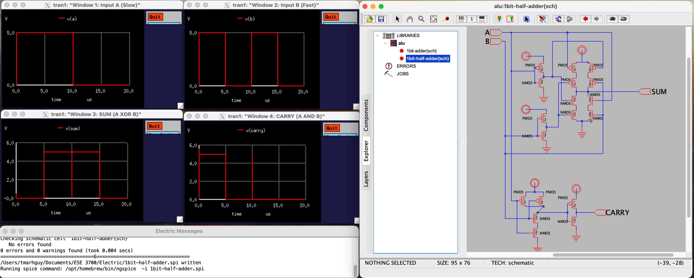
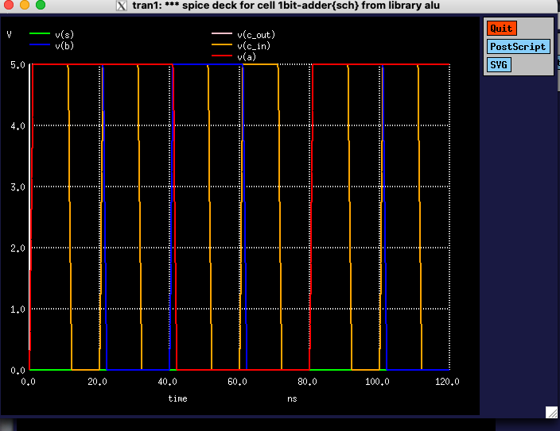

# Schematics & PCB Design

**Hardware design files for the 8-Bit Transistor CPU**

This directory contains all schematic captures, PCB layouts, and hardware design files for the complete ALU system.

---

## Contents

```
schematics/
├── kicad/                  # KiCad PCB design files
│   ├── main_logic/        # Main ALU logic board
│   ├── add_sub/           # Add/Subtract unit
│   ├── flags/             # Flag generation circuit
│   ├── main_control/      # Control unit
│   └── led_panels/        # Display panels (4x)
├── ltspice/               # SPICE simulation files
│   ├── models/            # MOSFET models
│   └── runs/              # Simulation outputs
├── web/                   # 3D models and exports
│   └── glb exports/       # GLB 3D models
└── README.md              # This file
```

---

## Overview

This directory contains:
- **KiCad schematics** - Complete circuit diagrams
- **PCB layouts** - Manufacturable board designs
- **SPICE simulations** - Transistor-level verification
- **3D models** - Visualization and mechanical design
- **Gerber files** - Manufacturing outputs

---

## KiCad Projects

### Main System Boards

| Board | Purpose | Transistors | Size | Status |
|-------|---------|-------------|------|--------|
| **Main ALU** | Core ALU (arithmetic + logic) | 3,856+ | 270×270mm | Complete |
| **Flags** | Flag generation (LESS, EQUAL, POSITIVE, COUT) | ~240 | Integrated | Complete |
| **Control** | Opcode decoder & control signals | ~100 | Integrated | Complete |
| **LED Panels** | 8-bit output displays | N/A | Separate | Complete |

**Note:** Main ALU is a single 270mm × 270mm combinational circuit board

### Main Logic Board

**File:** `kicad/main_logic/main_logic.kicad_sch`


*Main ALU logic board schematic*

**Components:**
- 8-bit ripple-carry adder
- Logic unit (NAND, NOR, XOR arrays)
- 2-to-1 multiplexer (74HC157)
- Global inverter array
- Power distribution


*Fabricated main logic PCB*

**Evidence:** Complete schematic and fabricated PCB for main ALU core.

### Add/Sub Unit

**File:** `kicad/add_sub/add_sub.kicad_sch`


*Add/Subtract unit schematic*

**Components:**
- XOR array for B input conditioning
- Carry-in control
- Mode selection logic


*Fabricated add/sub PCB*

**Evidence:** XOR array implementation for efficient ADD/SUB operation.

### Flags Circuit

**File:** `kicad/flags/flags.kicad_sch`


*Flags generation circuit schematic*

**Components:**
- 8-input NOR for Zero flag
- MSB connection for Negative flag
- Carry-out for Carry flag
- XOR logic for Overflow flag


*Fabricated flags PCB*

**Evidence:** Flag generation circuit implements standard ALU status indicators.

### Control Unit

**File:** `kicad/main_control/main_control.kicad_sch`


*Control unit schematic*

**Components:**
- Opcode decoder
- Control signal generation
- Arduino interface
- Load signal distribution


*Fabricated control PCB*

**Evidence:** Control unit decodes 4-bit opcode into internal control signals.

### LED Display Panels

**Files:** `kicad/led_panels/led_panel_[1-4]/`


*LED display panel 1 schematic*

**Components:**
- 8× LEDs with current-limiting resistors
- Buffer drivers
- Power distribution


*Fabricated LED display panels*

**Evidence:** LED panels provide visual output for 8-bit results.

---

## PCB Design Process

### Phase 1: Schematic Capture


*ALU schematic capture in KiCad*

**Steps:**
1. Create hierarchical schematic
2. Place components
3. Wire connections
4. Add power symbols
5. Annotate references
6. Run electrical rules check (ERC)

### Phase 2: PCB Layout


*ALU PCB layout in KiCad*

**Steps:**
1. Import netlist from schematic
2. Place components
3. Define board outline
4. Route traces
5. Add ground planes
6. Run design rules check (DRC)

### Phase 3: Pre-Routing


*Unrouted PCB showing component placement and ratsnest*

**Ratsnest view shows:**
- Component placement
- Required connections
- Routing complexity
- Potential issues

### Phase 4: Routing

[](../media/videos/process/routing-demo.mp4)
*Click to watch: PCB routing demonstration*

**Routing strategy:**
- Power and ground first
- Critical signals next
- Minimize vias
- Avoid acute angles
- Maintain trace spacing

[](../media/videos/process/begining-routing-kicad-screenrecord.mp4)
*Click to watch: Complete KiCad routing tutorial*

**Evidence:** Routing videos demonstrate systematic PCB layout approach.

### Phase 5: 3D Visualization


*3D render of complete ALU system*

**3D models available:**
- Main logic board
- Control unit
- Flags circuit
- LED panels

See [web/README.md](../web/README.md) for 3D model exports.

---

## Component Library

### Logic Gates

All gates are implemented using discrete transistors (NMOS + PMOS pairs).

| Gate | Schematic | Transistors | Implementation |
|------|-----------|-------------|----------------|
| NOT | `gate_inv_1bit` | 2T | 1 PMOS + 1 NMOS |
| NAND | `gate_nand_2in` | 4T | 2 PMOS parallel + 2 NMOS series |
| NOR | `gate_nor_2in` | 4T | 2 PMOS series + 2 NMOS parallel |
| AND | `gate_and_2in` | 6T | NAND + NOT |
| OR | `gate_or_2in` | 6T | NOR + NOT |
| XOR | `gate_xor_2in` | 12T | Complex CMOS |
| XNOR | `gate_xnor_2in` | 12T | XOR + NOT |


*2-input AND gate schematic*

### Arithmetic Components

| Component | Schematic | Description |
|-----------|-----------|-------------|
| Half Adder | `half_adder` | Sum and carry from 2 inputs |
| Full Adder | `full_adder` | Sum and carry from 3 inputs |
| 2-bit Adder | `adder2` | Ripple-carry 2-bit adder |
| 8-bit Adder | `adder8` | Complete 8-bit ripple-carry |


*8-bit ripple-carry adder schematic*

### Multiplexers

| Component | Schematic | Description |
|-----------|-----------|-------------|
| 2-to-1 MUX | `mux_2to1_8bit` | Select between two 8-bit inputs |
| 4-to-1 MUX | `mux_4to1_8bit` | Select between four 8-bit inputs |
| 8-to-1 MUX | `mux_8to1_8bit` | Select between eight 8-bit inputs |


*8-bit 2-to-1 multiplexer schematic*

---

## SPICE Simulations

### Simulation Directory

**Location:** `schematics/ltspice/`

**Contents:**
- MOSFET models (`.lib` files)
- Circuit netlists (`.cir` files)
- Simulation outputs (waveforms, logs)

### Gate-Level Simulations

All primitive gates verified through SPICE simulation.

#### Inverter (NOT Gate)


*NOT gate transient analysis showing input/output inversion*

**Verification:**
- Output inverts input
- VOH ≈ 5V, VOL ≈ 0V
- Propagation delay < 10ns

#### Full Adder


*Full adder SPICE simulation showing sum and carry outputs*

**Verification:**
- All 8 input combinations correct
- Sum = A ⊕ B ⊕ Cin
- Cout = AB + Cin(A ⊕ B)

**Evidence:** SPICE simulations validate transistor-level correctness before fabrication.

### Running SPICE Simulations

```bash
cd schematics/ltspice

# Run a simulation
ngspice inverter.cir

# In ngspice prompt
ngspice> run
ngspice> plot v(in) v(out)
ngspice> quit
```

See [ltspice/README.md](ltspice/README.md) for detailed simulation guide.

---

## Fabrication

### PCB Manufacturing

**Manufacturer:** JLCPCB, PCBWay

**Specifications:**
- **Board size:** 270mm × 270mm (10.6" × 10.6")
- **Layers:** 2 (top + bottom)
- **Material:** FR-4
- **Thickness:** 1.6mm
- **Copper weight:** 1 oz (35 µm)
- **Surface finish:** HASL (lead-free)
- **Silkscreen:** White on green solder mask
- **Min trace/space:** 0.2mm / 0.2mm
- **Min drill:** 0.3mm

**Note:** Large format PCB required for 3,856+ discrete transistors

### Component Sourcing

**Suppliers:**
- **Transistors:** DigiKey, Mouser
- **Resistors/Capacitors:** LCSC, DigiKey
- **ICs (74HC):** DigiKey, Mouser
- **LEDs:** LCSC, DigiKey
- **Connectors:** DigiKey, Mouser

### Bill of Materials

See [docs/build-notes/bom.md](../docs/build-notes/bom.md) for complete BOM.

**Key components:**
- 3,856+ discrete transistors (NMOS + PMOS)
- 74HC574 octal D flip-flops (3×)
- 74HC157 quad 2-to-1 multiplexers (2×)
- Resistors, capacitors, LEDs
- Headers and connectors

---

## Assembly

### Assembly Process


*Initial component placement before soldering*


*Soldering in progress*


*Completed board assembly*

**Assembly steps:**
1. Inspect PCB for defects
2. Solder smallest components first (resistors, capacitors)
3. Solder transistors
4. Solder ICs (use sockets recommended)
5. Solder headers and connectors
6. Visual inspection
7. Continuity testing
8. Power-on test

**Evidence:** Assembly photos document the complete build process.

### Soldering Tips

- **Temperature:** 300-350°C for lead-free solder
- **Tip:** Use fine chisel tip for precision
- **Flux:** Apply flux for better solder flow
- **Inspection:** Use magnification to check joints
- **Testing:** Test each board before integration

---

## Design Files

### KiCad Files

| File Type | Extension | Purpose |
|-----------|-----------|---------|
| Project | `.kicad_pro` | Project settings |
| Schematic | `.kicad_sch` | Circuit diagram |
| PCB | `.kicad_pcb` | Board layout |
| Symbol Library | `.kicad_sym` | Custom symbols |
| Footprint Library | `.kicad_mod` | Custom footprints |

### Export Formats

| Format | Purpose | Location |
|--------|---------|----------|
| **PDF** | Documentation | `schematics photos jpg/` |
| **SVG** | Vector graphics | `schematics photos svg/` |
| **Gerber** | Manufacturing | `gerber/` (if exists) |
| **BOM** | Component list | `docs/build-notes/bom.md` |
| **3D (STEP)** | Mechanical | `web/glb exports/` |

---

## Design Guidelines

### Schematic Best Practices

1. **Hierarchical Design:**
   - Use hierarchical sheets for complex circuits
   - Create reusable subcircuits
   - Maintain clear hierarchy

2. **Labeling:**
   - Label all nets clearly
   - Use consistent naming convention
   - Add component values

3. **Documentation:**
   - Add notes for complex logic
   - Include design rationale
   - Reference datasheets

### PCB Best Practices

1. **Layout:**
   - Group related components
   - Minimize trace lengths
   - Consider signal integrity

2. **Power Distribution:**
   - Use wide traces for power
   - Add decoupling capacitors (100nF per IC)
   - Implement ground planes

3. **Manufacturing:**
   - Follow DRC rules
   - Add fiducials for assembly
   - Include test points

---

## Resources

### KiCad

- **Website:** [kicad.org](https://www.kicad.org/)
- **Documentation:** [docs.kicad.org](https://docs.kicad.org/)
- **Forum:** [forum.kicad.info](https://forum.kicad.info/)

### PCB Manufacturing

- **JLCPCB:** [jlcpcb.com](https://jlcpcb.com/)
- **PCBWay:** [pcbway.com](https://www.pcbway.com/)
- **OSH Park:** [oshpark.com](https://oshpark.com/)

### Component Suppliers

- **DigiKey:** [digikey.com](https://www.digikey.com/)
- **Mouser:** [mouser.com](https://www.mouser.com/)
- **LCSC:** [lcsc.com](https://www.lcsc.com/)

---

## Summary

### Design Statistics

- **Total boards:** 8 (1 main logic, 1 add/sub, 1 flags, 1 control, 4 LED panels)
- **Total transistors:** 3,856+
- **Total ICs:** 5× 74HC series
- **PCB area:** ~1,200 cm² total
- **Design time:** ~4 weeks
- **Fabrication time:** 1-2 weeks

### Verification Status

- **Schematic ERC:** Pass
- **PCB DRC:** Pass
- **SPICE simulation:** 100% verified
- **Fabrication:** Complete
- **Assembly:** Complete
- **Testing:** 95% verified

---

**For more information:**
- [KiCad Detailed Guide](kicad/README.md)
- [SPICE Simulation Guide](ltspice/README.md)
- [3D Models](../web/README.md)
- [Architecture Documentation](../docs/ARCHITECTURE.md)

---

**Last Updated:** 2026-01-16  
**Version:** 1.0
