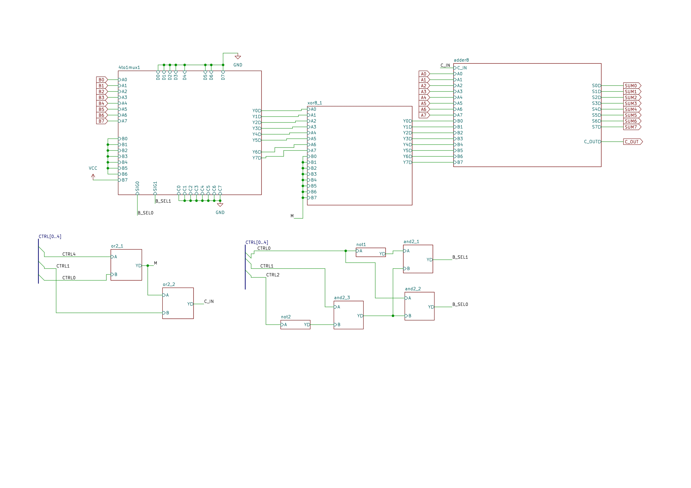
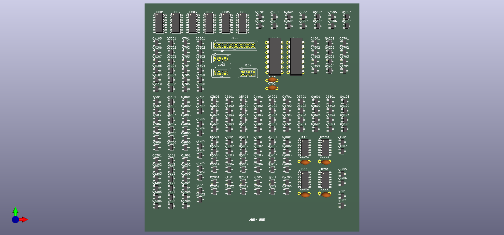
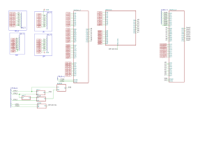

# Board Designs

**Individual PCB boards for the 8-Bit Transistor ALU system**

This directory contains KiCad projects for each functional board in the ALU system.

---

## Board Inventory

| Board | Size | Transistors | Purpose | Status |
|-------|------|-------------|---------|--------|
| [alu/](alu/) | 270×270mm | 3,856+ | **Main combinational ALU** (monolithic) | Complete |
| [main_logic/](main_logic/) | varies | 640+ | Logic unit subsystem | Complete |
| [add_sub/](add_sub/) | varies | 120+ | Add/subtract XOR array | Complete |
| [flags/](flags/) | varies | ~240 | Flag generation (LESS/EQUAL/POSITIVE/COUT) | Complete |
| [main_control/](main_control/) | varies | ~100 | Opcode decoder | Complete |
| [led_panel/](led_panel/) | varies | 0 | Output display panels | Complete |

**Note:** The ALU can be implemented as:
- **Monolithic:** Single 270×270mm board (alu/)
- **Modular:** Separate boards (main_logic/, add_sub/, flags/, main_control/)

Current implementation uses modular approach for easier assembly and debugging.

---

## Monolithic ALU Board

**Directory:** `alu/`

**Description:** Complete 8-bit ALU on single 270×270mm PCB

**Contents:**
- All arithmetic logic (adder + XOR array)
- All logic functions (NAND/NOR/XOR/PASS)
- 2:1 MUX and global inverter
- Flag generation
- Control decoder
- Power distribution

**Advantages:**
- Single board design
- No inter-board connections
- Lower assembly complexity
- Optimal signal integrity

**Challenges:**
- Large format PCB (higher cost)
- Difficult to debug subsystems
- Must solder all 3,856+ transistors before testing

---

## Modular Board System

### Main Logic Board

**Directory:** `main_logic/`

**Schematic:** [main_logic.kicad_sch](main_logic/main_logic.kicad_sch)


*Figure 1 - Main logic unit schematic*

**Function:** Core logic operations (NAND, NOR, XOR, PASS)

**Transistors:** 640+

**Interfaces:**
```
IN:  A[7:0], B[7:0], LOGIC_SEL[2:0], VCC, GND
OUT: LOGIC_OUT[7:0]
```


*Figure 2 - Fabricated main logic board*

**Evidence:** Logic unit board fabricated and tested.

### Add/Sub Board

**Directory:** `add_sub/`

**Schematic:** [add_sub.kicad_sch](add_sub/add_sub.kicad_sch)


*Figure 3 - Add/subtract module schematic*

**Function:** 8-bit ripple-carry adder with conditional B inversion

**Components:**
- 8× 1-bit full adders (336T)
- 8× XOR gates for B (96T)
- Carry chain routing

**Interfaces:**
```
IN:  A[7:0], B[7:0], M (ADD/SUB), Cin, VCC, GND
OUT: SUM[7:0], COUT
```


*Figure 4 - Fabricated add/subtract board*

**Evidence:** Arithmetic unit core module.

### Flags Board

**Directory:** `flags/`

**Schematic:** [flags.kicad_sch](flags/flags.kicad_sch)


*Figure 5 - Flags generation circuit*

**Function:** Generate comparison and status flags

**Flag Implementations:**
- **EQUAL (~100T):** 8-bit XOR + NOR comparator
- **LESS (~120T):** Cascaded magnitude comparator
- **POSITIVE (~20T):** (OUT > 0) detector
- **COUT (0T):** Direct routing from adder

**Interfaces:**
```
IN:  A[7:0], B[7:0], OUT[7:0], COUT_IN, VCC, GND
OUT: LESS, EQUAL, POSITIVE, COUT
```


*Figure 6 - Fabricated flags board*

**Evidence:** Dedicated flag generation hardware.

### Control Board

**Directory:** `main_control/`

**Schematic:** [main_control.kicad_sch](main_control/main_control.kicad_sch)


*Figure 7 - Control unit opcode decoder*

**Function:** Decode 5-bit opcode to control signals

**Decoding:**
```
FUNC[4:0] → Combinational logic → {M, MUX_SEL, INV_OUT, LOGIC_SEL[2:0]}
```

**Transistors:** ~68T (decode logic gates)

**Interfaces:**
```
IN:  FUNC[4:0], VCC, GND
OUT: M, MUX_SEL, INV_OUT, LOGIC_SEL[2:0]
```


*Figure 8 - Fabricated control decoder board*

**Evidence:** Control unit generates all internal control signals from opcode.

### LED Display Panels

**Directory:** `led_panel/`

**Purpose:** Visual output display for 8-bit results

**Panels:**
- led_panel_1 - Bits [7:4]
- led_panel_2 - Bits [3:0]
- led_panel_3 - Flags
- led_panel_4 - Opcode display


*Figure 9 - LED display panel for upper nibble*


*Figure 10 - LED display panel for lower nibble*

**Evidence:** LED panels provide binary output visualization.

---

## Design Guidelines

### Schematic Best Practices

1. **Hierarchical design:**
   - Use subcircuits for repeated structures
   - Keep hierarchy shallow (3 levels max)
   - Clear signal flow left-to-right

2. **Net labeling:**
   - Label all buses: `A[7:0]`, not `A7 A6 A5...`
   - Use global labels for multi-sheet signals
   - Descriptive names: `ARITH_OUT[7:0]` not `O[7:0]`

3. **Power:**
   - Explicit power symbols
   - Decoupling caps near ICs (100nF)
   - Bulk caps on board (10µF)

### PCB Best Practices

1. **Component placement:**
   - Group by function
   - Signal flow matches schematic
   - Minimize trace lengths for critical paths

2. **Routing:**
   - Power rails: 1mm+ traces
   - Signals: 0.3-0.5mm traces
   - Ground plane on bottom layer
   - Avoid acute angles (>45°)

3. **Manufacturing:**
   - Follow DRC rules (0.2mm min spacing)
   - Add fiducials for assembly
   - Include test points
   - Add mounting holes

---

## Manufacturing Specs

### PCB Specifications

| Parameter | Value | Manufacturer Capability |
|-----------|-------|------------------------|
| Min trace width | 0.2mm | Standard |
| Min trace spacing | 0.2mm | Standard |
| Min drill size | 0.3mm | Standard |
| Copper weight | 1oz (35µm) | Standard |
| Board thickness | 1.6mm | Standard |
| Surface finish | HASL lead-free | Standard |
| **Board size** | **270×270mm** | **Large format** |

**Note:** 270×270mm exceeds standard 100×100mm size. Confirm manufacturer supports large format before ordering.

---

## Bill of Materials

### Component Summary

| Category | Quantity | Example Part | Estimated Cost |
|----------|----------|--------------|----------------|
| **NMOS Transistors** | ~2,000 | 2N7000 | $80 |
| **PMOS Transistors** | ~2,000 | BS250 | $80 |
| **74HC157 (MUX)** | 2 | 74HC157N | $2 |
| **Resistors** | ~500 | 10kΩ, 220Ω | $20 |
| **Capacitors** | ~50 | 100nF, 10µF | $15 |
| **LEDs** | ~32 | Red 5mm | $8 |
| **Headers** | ~20 | 2.54mm pitch | $10 |
| **PCB (270×270mm)** | 1 | Large format | $100 |
| **Total** | | | **~$315** |

See [docs/build-notes/bom.md](../../docs/build-notes/bom.md) for complete BOM.

---

## Testing

### Per-Board Testing

**Test each board before integration:**

1. **Power test:**
   ```
   VCC input → Measure at far end
   Acceptable: < 5% voltage drop
   ```

2. **Continuity:**
   ```
   Check all critical signal paths
   Verify no shorts (VCC to GND)
   ```

3. **Functional:**
   ```
   Apply known inputs
   Measure outputs
   Compare with expected (simulation/calculation)
   ```

### Integration Testing

1. Connect boards via headers
2. Apply power (5V)
3. Test simple operation (e.g., ADD 1 + 1)
4. Verify output and flags
5. Test all 19 operations systematically

---

## Summary

### Design Status

- All schematics complete and verified
- All PCB layouts routed and DRC-clean
- Gerber files generated
- BOMs complete
- Boards fabricated
- Assembly in progress (modular boards complete)

### Key Features

- **270×270mm main ALU** or modular boards
- **3,856+ discrete transistors**
- **5V CMOS logic**
- **Pure combinational architecture**
- **Fabrication-ready Gerbers**

---

**For detailed board documentation, see individual board directories.**

---

**Last Updated:** 2026-01-16  
**Version:** 1.0
